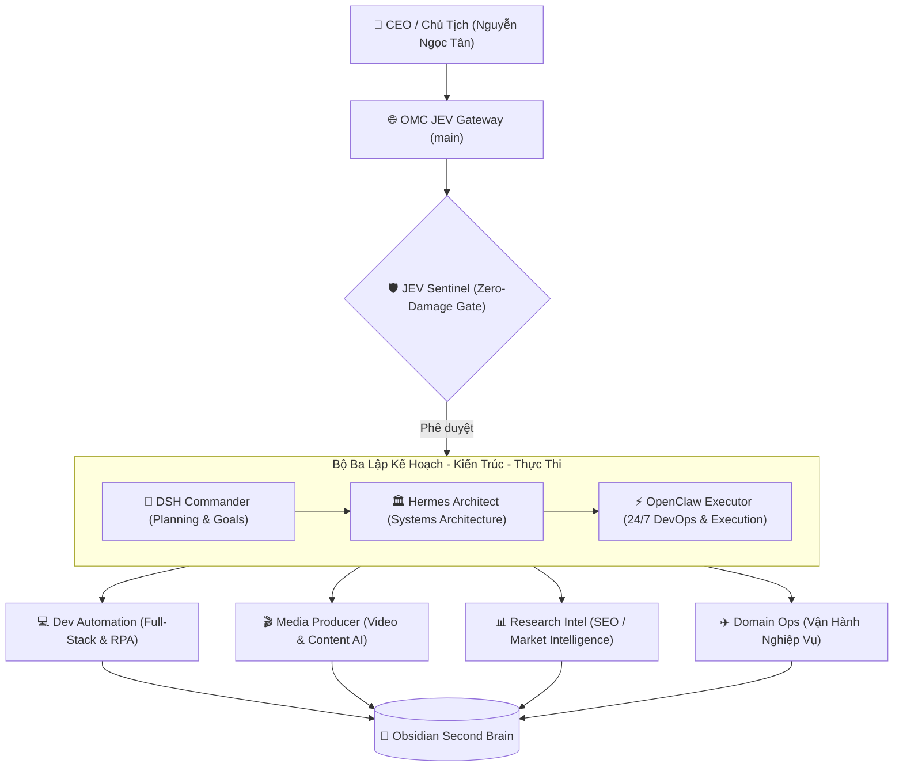

# 👥 Sơ Đồ Tổ Chức Bộ Máy OMC (9 Phòng Ban)

```mermaid
graph TD
    User["👑 CEO / Chủ Tịch (Nguyễn Ngọc Tân)"] --> Gateway["🌐 OMC JEV Gateway (main)"]
    Gateway --> Safety{"🛡️ JEV Sentinel (Zero-Damage Gate)"}
    
    Safety -->|Phê duyệt| Trio["⚡ OMC Tri-Engine Orchestrator"]
    
    subgraph Trio["Bộ Ba Lập Kế Hoạch - Kiến Trúc - Thực Thi"]
        DSH["🎯 DSH Commander (Planning & Goals)"]
        Hermes["🏛️ Hermes Architect (Systems Architecture)"]
        OpenClaw["⚡ OpenClaw Executor (24/7 DevOps & Execution)"]
        DSH --> Hermes --> OpenClaw
    end
    
    Trio --> Dev["💻 Dev Automation (Full-Stack & RPA)"]
    Trio --> Media["🎬 Media Producer (Video & Content AI)"]
    Trio --> Intel["📊 Research Intel (SEO / Market Intelligence)"]
    Trio --> Ops["✈️ Domain Ops (Vận Hành Nghiệp Vụ)"]
    
    Dev --> Vault[("📓 Obsidian Second Brain")]
    Media --> Vault
    Intel --> Vault
    Ops --> Vault
```
